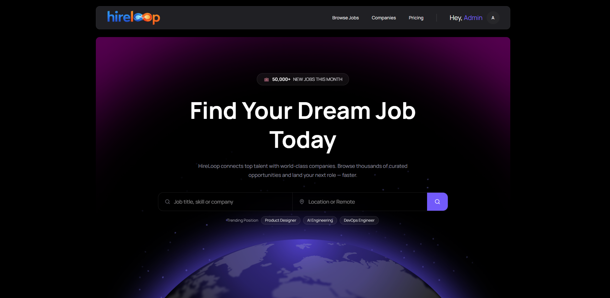

# HireLoop - Modern Job Portal Platform



HireLoop is a modern full-stack job portal platform built to connect **Job Seekers**, **Recruiters**, and **Administrators** in one seamless ecosystem. The platform enables recruiters to register companies, publish job opportunities, manage applicants, while job seekers can discover jobs, apply online, and track their applications. Administrators have complete control over users, companies, subscriptions, and platform management.

---

## 🌐 Live Demo

### Client

https://hireloop-client-livid.vercel.app

### Server API

https://hireloop-server-chi.vercel.app

---

## 🔗 GitHub Repositories

### Client Repository

https://github.com/tawhidzihad/hireloop-client

### Server Repository

https://github.com/tawhidzihad/hireloop-server

---

# ✨ Core Features

## 👨‍💼 Job Seeker

- User authentication using Better Auth
- Browse all available jobs
- Search jobs by title, company name, or category
- Filter jobs by
   - Job Type
   - Company Category
   - Remote Jobs
- View complete job details
- Apply for jobs
- Monthly application limits based on subscription plans
- Premium plan support
- Track submitted applications
- Personal dashboard with statistics

---

## 🏢 Recruiter

- Register company profile
- Upload company logo
- Company approval workflow
- Create new job posts
- Edit/Delete job posts
- View all posted jobs
- Manage applications
- Recruiter Dashboard
- Subscription plans with posting limits

---

## 🛡️ Admin Panel

- Dashboard analytics
- Manage all users
- Change user roles
- Suspend / Unsuspend users
- Manage company approvals
- Approve / Reject company registrations
- Platform overview

---

## 💳 Subscription System

### Job Seeker Plans

- Free
- Pro
- Premium

### Recruiter Plans

- Free
- Growth
- Enterprise

Integrated with **Stripe Checkout** for secure subscription payments.

---

## 🔐 Authentication

Authentication is handled using **Better Auth** with MongoDB.

Features include

- Email & Password Authentication
- Session Management
- Protected Routes
- Role-based Authorization
- Admin Plugin
- User Ban / Unban
- Recruiter & Seeker Roles

---

# 🛠 Tech Stack

## Frontend

- Next.js 16
- React 19
- Tailwind CSS v4
- HeroUI v3
- Motion
- Lucide React
- React Icons

---

## Forms & Validation

- React Hook Form

---

## Authentication

- Better Auth
- MongoDB Adapter

---

## Database

- MongoDB

---

## Payments

- Stripe

---

## Charts

- Recharts

---

## Notifications

- React Hot Toast

---

# 📂 Project Structure

```
src
│
├── app
│   ├── (auth)
│   ├── dashboard
│   ├── jobs
│   ├── pricing
│   ├── companies
│   └── api
│
├── components
│   ├── auth
│   ├── dashboard
│   ├── home
│   ├── jobs
│   ├── pricing
│   ├── shared
│   └── ui
│
├── hooks
│
├── lib
│   ├── api
│   ├── auth
│   ├── db
│   ├── stripe
│   └── utils
│
├── providers
│
├── middleware.js
│
└── styles
```

---

# ⚙️ Environment Variables

Create a `.env.local` file in the project root and add the following variables.

```env
# Stripe
STRIPE_SECRET_KEY=
NEXT_PUBLIC_STRIPE_PUBLISHABLE_KEY=

# Image Upload
NEXT_PUBLIC_IMGBB_API_KEY=

# Database
MONGODB_URI=

# Better Auth
BETTER_AUTH_SECRET=
BETTER_AUTH_URL=https://hireloop-client-livid.vercel.app

# Base URLs
NEXT_PUBLIC_BASE_URL=https://hireloop-client-livid.vercel.app
NEXT_PUBLIC_BASE_API_URL=https://hireloop-server-chi.vercel.app
```

---

# 🚀 Getting Started

## 1. Clone the repository

```bash
git clone https://github.com/tawhidzihad/hireloop-client.git
```

---

## 2. Navigate to the project

```bash
cd hireloop-client
```

---

## 3. Install dependencies

```bash
npm install
```

---

## 4. Configure Environment Variables

Create a `.env.local` file and add all required environment variables.

---

## 5. Start the development server

```bash
npm run dev
```

Visit

```
http://localhost:3000
```

---

# 📜 Available Scripts

Run development server

```bash
npm run dev
```

Build production

```bash
npm run build
```

Start production server

```bash
npm start
```

Run ESLint

```bash
npm run lint
```

---

# 📦 Main Dependencies

- Next.js
- React
- Tailwind CSS
- HeroUI
- Better Auth
- MongoDB
- Stripe
- Recharts
- Motion
- React Hook Form
- Lucide React
- React Hot Toast

---

# 🎯 Future Improvements

- Resume Upload
- Interview Scheduling
- Saved Jobs
- AI Job Recommendations
- Email Notifications
- Company Verification Badge
- Real-time Notifications
- Recruiter Messaging
- Applicant Resume Preview
- Dark / Light Theme Enhancements

---

# 👨‍💻 Developer

**Tawhid Zihad**

MERN Stack Developer

GitHub: https://github.com/tawhidzihad

---

## ⭐ Support

If you found this project helpful, consider giving the repository a **star ⭐**. It helps support the project and motivates future improvements.
